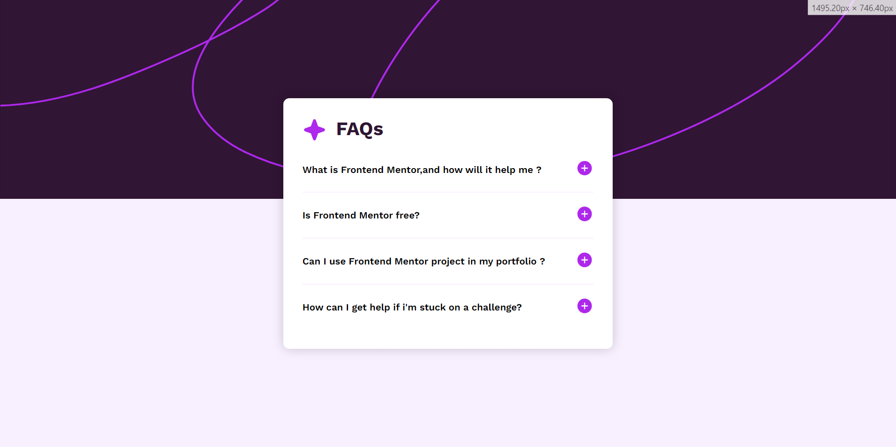
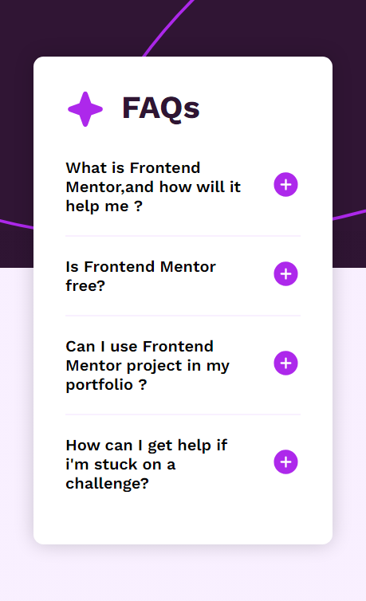

# Frontend Mentor - FAQ accordion solution

This is a solution to the [FAQ accordion challenge on Frontend Mentor](https://www.frontendmentor.io/challenges/faq-accordion-wyfFdeBwBz). Frontend Mentor challenges help you improve your coding skills by building realistic projects. 

## Table of contents

- [Overview](#overview)
  - [Screenshot](#screenshot)
  - [Links](#links)
- [My process](#my-process)
  - [Built with](#built-with)
- [Author](#author)

## Overview

### Screenshot

#### Desktop Veriosn :

#### Mobile Version:

### Links

- Live Site URL: [Live Server](https://plmohamed.github.io/FAQ-accordion/)

## My process

### Built With :
  * HTML 5
  * CSS custom properties
  * CSS FlexBox
  * JavaScript

## Author

  - Frontend Mentor - [@PLMohamed](https://www.frontendmentor.io/profile/PLMohamed)
  - Instagram - [@Mohamed_Boumedine](https://www.instagram.com/mohamed_boumedine/)
